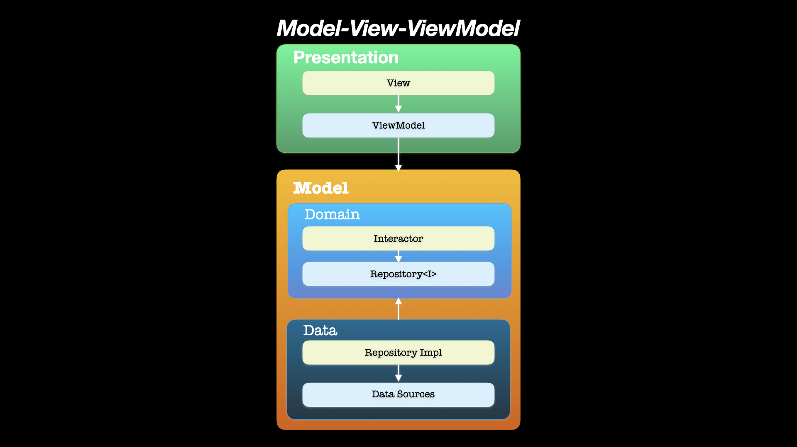

# Travelling 

An Android mobile application, which gives a convenient way to collect all countries that you have
visited.

## PROJECT SPECIFICATION

• Programming language: [Kotlin](https://kotlinlang.org/);

• SDK: [Android](https://developer.android.com/studio/intro);

• Database: [Room](https://developer.android.com/training/data-storage/room);

• HTTP client: [Retrofit](https://square.github.io/retrofit/);

• Interface: [XML](https://developer.android.com/guide/topics/ui/declaring-layout);

• State management approach:
[ViewModel](https://developer.android.com/reference/androidx/lifecycle/ViewModel);

• Dependency injection: [Koin](https://insert-koin.io/docs/reference/introduction);

• Version control system: [Git](https://git-scm.com);

• Git Hosting Service: [GitHub](https://github.com);

• CI/CD: [GitHub Actions](https://docs.github.com/en/actions) is used to deliver new Android
Package (APK) to [Firebase App Distribution](https://firebase.google.com/docs/app-distribution)
after every push to the **dev** branch,
[Visual Studio App Center](https://docs.microsoft.com/en-us/appcenter/) is used to
[deliver](https://appcenter.ms/users/Turskyi/apps/Travelling/build/branches/master) new release
app bundle to **Google Play** after every push to **master** branch;

• App testing platforms:
[Firebase App Distribution](https://appdistribution.firebase.dev/i/c6a7f44dbe6de66d);

• App store: [Google Play](https://play.google.com/store/apps/details?id=ua.turskyi.travelling);

• Operating system: [Android](https://www.android.com/);

• Embedded SDK: [Facebook Sharing](https://developers.facebook.com/docs/sharing/android);

• Asynchronous programming: [Coroutines](https://developer.android.com/kotlin/coroutines);

• Google Play services: [Location](https://developer.android.com/training/location);

• Cloud services: [Firebase Cloud Messaging](https://firebase.google.com/docs/cloud-messaging);

• UI components:
[Lottie](https://lottiefiles.com/what-is-lottie),
[PhotoView](https://github.com/Baseflow/PhotoView),
[ViewPager2](https://developer.android.com/jetpack/androidx/releases/viewpager2),
[Data chart](https://weeklycoding.com/mpandroidchart/),
[RecyclerView](http://www.recyclerview.org/),
[Loading SVG](https://github.com/corouteam/GlideToVectorYou),
[Glide](https://bumptech.github.io/glide/),
[Data Binding](https://developer.android.com/topic/libraries/data-binding);

• Api: https://restcountries.com/#api-endpoints-v2-all;

• Architecture Components:
[Paging](https://developer.android.com/topic/libraries/architecture/paging),
[LiveData](https://developer.android.com/topic/libraries/architecture/livedata),
[ViewModel](https://developer.android.com/topic/libraries/architecture/viewmodel);

• Architectural pattern:
 

 
• Screenshots:

• **Code Readability:** code is easily readable with no unnecessary blank lines, no unused variables
or methods, and no commented-out code, all variables, methods, and resource IDs are descriptively
named such that another developer reading the code can easily understand their function.
